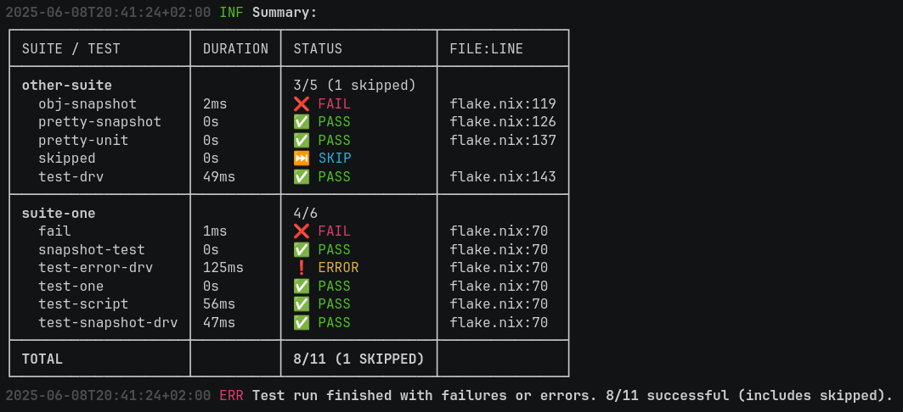
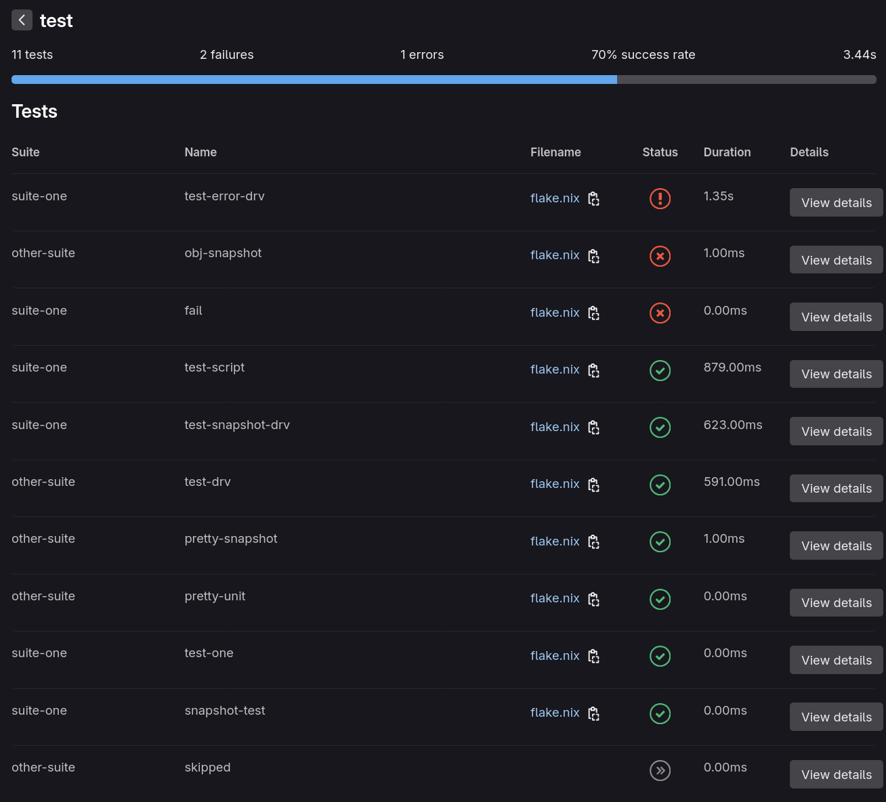

# Nixtest

Flexible test runner for testing Nix code, written in Go.

## Features

- Snapshot, Unit (equal checks) and Script-Tests (unit tests with assertions you could say)
- Supports testing against raw Nix code or derivation output
- Simple and easy to read summary of test results
    
- Junit report support (eg. for displaying the results in GitLab etc.)
    
